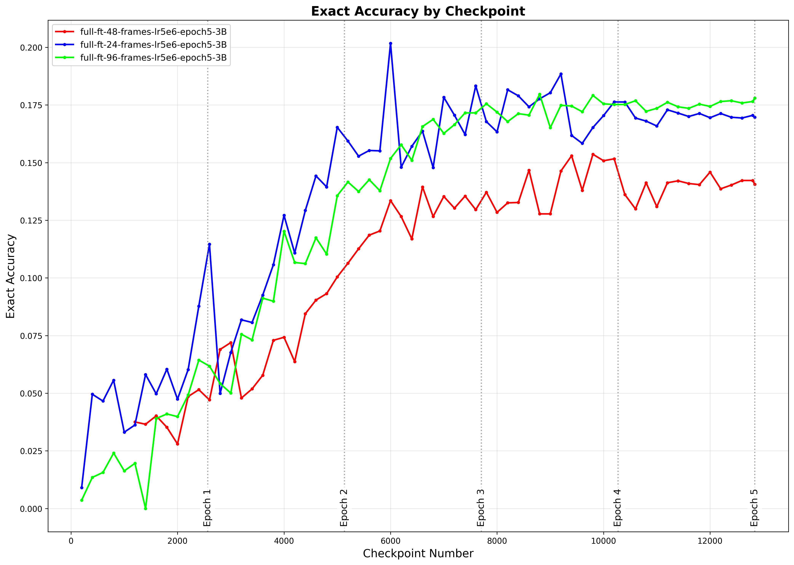
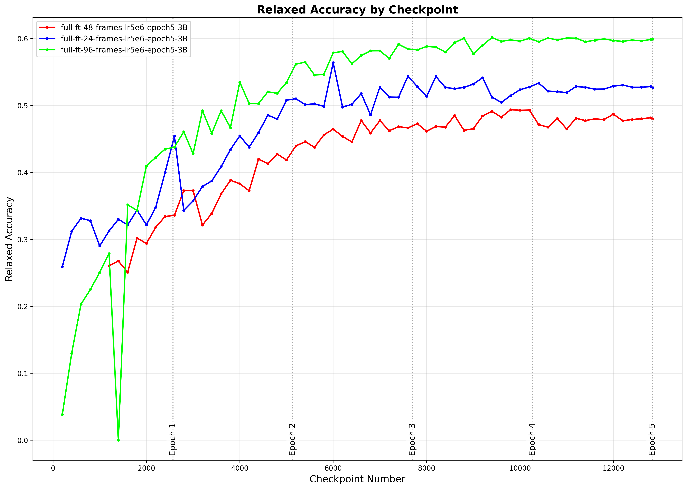

# FindingDory VLM Training

<a href="https://arxiv.org/abs/2506.15635" target="_blank">
    
</a>
<a href="https://findingdory-benchmark.github.io/" target="_blank">
    
</a>
<a href="https://github.com/findingdory-benchmark/findingdory-trl" target="_blank">
    
</a>

<div align="center">
<h1>FindingDory: A Benchmark to Evaluate Memory in Embodied Agents</h1>
<p>
  <a href="https://www.karmeshyadav.com/">Karmesh Yadav*</a>, 
  <a href="https://yusufali98.github.io/">Yusuf Ali*</a>,
  <a href="https://gunshigupta.netlify.app/">Gunshi Gupta</a>,
  <a href="https://www.cs.ox.ac.uk/people/yarin.gal/website/">Yarin Gal</a>,
  <a href="https://faculty.cc.gatech.edu/~zk15/">Zsolt Kira</a>
</p>
</div>

Minimal repository for fine-tuning and evaluating Vision-Language Models (VLMs) on [FindingDory](https://findingdory-benchmark.github.io/) dataset.

## Setup

After cloning the repository, simply run the setup script:

```bash
./setup.sh
```

This will handle all the necessary dependencies and environment configuration.

## Usage

### Fine-tuning VLM

To fine-tune a Vision-Language Model on FindingDory data, use the provided SLURM script:

```bash
sbatch slurm_files/launch_findingdory_sft.sh
```

> **Note**: This script uses a subsampled version of the FindingDory dataset where all original videos are evenly downsampled to 96 frames. Dataset available at: [yali30/findingdory-subsampled-96](https://huggingface.co/datasets/yali30/findingdory-subsampled-96)
> 
> The original dataset with full-length videos can be found at: [yali30/findingdory](https://huggingface.co/datasets/yali30/findingdory)

### Evaluation

#### Parallel Checkpoint Evaluation

Run parallel evaluation jobs over multiple checkpoints from various experiment runs:

```bash
sbatch slurm_files/launch_findingdory_ckpt_evals.sh
```

> **Best Model**: We provide our best trained model checkpoint here: [yali30/findingdory-qwen2.5-VL-3B-finetuned](https://huggingface.co/yali30/findingdory-qwen2.5-VL-3B-finetuned)

#### Metrics Aggregation

Aggregate exact/relaxed accuracy metrics across various checkpoints:

```bash
python findingdory/evaluate_llm_outputs.py --root_dir <directory_with_experiment_subfolders> --output_file <output_json_file_with_aggregated_results>
```

**Evaluation Metrics:**
- **Exact Accuracy**: Performs exact string matching between the predicted and ground-truth frame lists. The VLM is fine-tuned to predict the list of all frame indices that will exactly solve the task in consideration. [[code]](https://github.com/findingdory-benchmark/findingdory-train/blob/main/findingdory/evaluate_llm_outputs.py#L98-L100)
- **Relaxed Accuracy**: Considers a predicted sublist as correct if any frame index in the predicted sublist belongs to the ground-truth frame lists. For multi-goal tasks, we compute the relaxed accuracy over each sublist in the predicted list. [[code]](https://github.com/findingdory-benchmark/findingdory-train/blob/main/findingdory/evaluate_llm_outputs.py#L111-L112)

> **Note**: These are offline evaluations on the SFT dataset without simulator in the loop for selecting the best performing checkpoint for downstream simulator evaluations (see Appendix D.5 of [our paper](https://arxiv.org/pdf/2506.15635) for more details). Once the best checkpoint for each frame susampling level is selected via offline evaluations, we run simulator-in-loop evaluations (see Fig.4(a) of paper "Qwen-SFT" baseline). 

**Offline Evaluation Results:**

<div align="center">
<h4>Exact Accuracy</h4>


<h4>Relaxed Accuracy</h4>

</div>